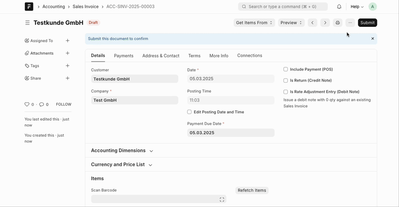
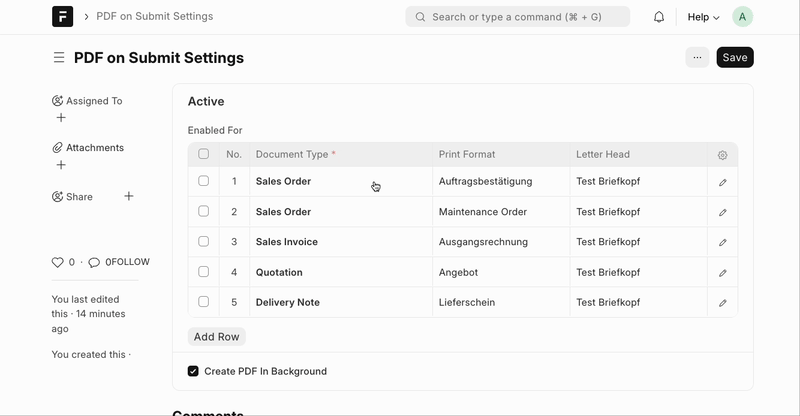

# PDF on Submit

Automatically generates and attaches a PDF when a document gets submitted. Works for printable & submittable Doctypes.


## Install on Frappe Cloud

1. Go to https://frappecloud.com/dashboard/#/sites and click the "New Site" button.
2. In Step 2 ("Select apps to install"), select "PDF on Submit".
3. Complete the new site wizard.

## Install on Self-Hosted

```bash
cd frappe-bench
bench get-app https://github.com/alyf-de/pdf_on_submit.git
bench --site MY_SITE install-app pdf_on_submit
```

> Remeber to replace `MY_SITE` with your site name.

## Settings

To change the settings of this app, you can open **PDF on Submit Settings** via the search bar.

In the _Enabled For_ table, add a row for each DocType you want to enable PDF generation for.

If you don't choose a different configuration, PDFs will be generated with the default **Print Format** and **Letter Head**. The PDF is named like the document name.

Alternatively, you can choose a different **Print Format** and **Letter Head** for each DocType. You can also define a custom format for the PDF file name.



### Filters and different PDFs for the same DocType

It is possible to add multiple rows for the same DocType. In the row's _Filters_ section you can set filters based on the fields of the selected DocType. This way you can generate different PDFs based on the document's content. E.g. say you have two different print formats for the **Sales Invoice** DocType: one for normal invoices and one for credit notes. You can create two rows with different Print Formats and apply a filter on the _Is Return_ field. This way, when you submit a credit note, the PDF will be generated with the credit note's print format and when you submit a normal invoice, the PDF will be generated with the normal invoice's print format. However, the filters don't need to be exclusive. You can also generate multiple PDFs for the same document.

### Background PDF generation

The option _Create PDF in Background_ should be enabled if you want to continue your work immediately. The PDFs will just appear once they are created. (This might require a reload of the current document.) This is recommended if you usually submit many documents in bulk.

Disable this option to get the PDF immediately. In this case, when you submit the document you will see a progress bar while the PDF gets created. When it's done you'll immediately see the PDF attached to the document. This is recommended if you usually submit one document at a time.

### Language

The PDF will be created in the language that is specified in the _Language_ field of the current document. In your **Customer** and **Supplier** masters you can choose their respective _Print Language_.

## Add translations

To add translations for a new language, please copy `pdf_on_submit/locale/main.pot` to `pdf_on_submit/locale/<language_code>.po` and fill in the translations (`msgstr`) for each `msgid`. When you're done, you can commit your changes and send a PR.

## Helpers

### `split_quill`

This helper function is used to split the HTML content of a Quill editor into a list of HTML strings, each representing a direct child of the editor div. This is useful for breaking text-editor content into separate table rows in a print format.

```jinja
<table>
    
        <tr>
            <td>{{ paragraph }}</td>
        </tr>
    
</table>
```

### `get_serial_numbers`

This helper function is used to get the serial numbers for a transaction row. The row is expected to have either a `serial_no` or a `serial_and_batch_bundle` field.

```jinja

    {{ serial_number }}

```

## Licence

Copyright (C) 2025  ALYF GmbH <hallo@alyf.de>

This program is free software: you can redistribute it and/or modify
it under the terms of the GNU General Public License as published by
the Free Software Foundation, either version 3 of the License, or
(at your option) any later version.

This program is distributed in the hope that it will be useful,
but WITHOUT ANY WARRANTY; without even the implied warranty of
MERCHANTABILITY or FITNESS FOR A PARTICULAR PURPOSE.  See the
GNU General Public License for more details.

You should have received a copy of the GNU General Public License
along with this program.  If not, see <https://www.gnu.org/licenses/>.
